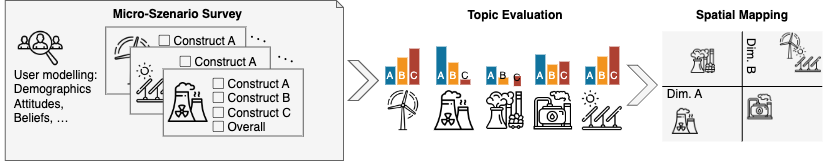
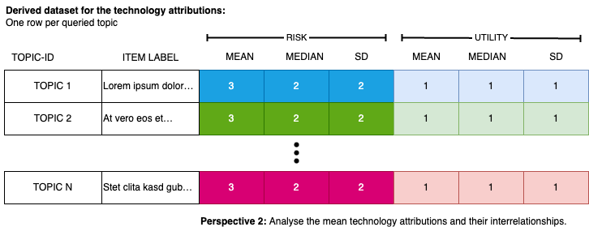

# Introduction

The micro-scenario approach simplifies measuring people's opinions on different topics (see [overview](index.qmd)).
Based on a single survey, the approach combines participants' responses into three complementary outputs: 0) a grand mean serving as a general evaluation of the whole topic field, 1) individual user factors as reflexive measurements of latent constructs (research perspective 1), and 2) topic-level evaluations for ranking topics and creating visual maps to pinpoint areas of concern (research perspective 2).

For instance, consider analysing risk-utility trade-offs among various technologies:
Do individuals attribute varying risks and utilities to distinct technologies?
Are people predisposed to different risk or utility perceptions?
Is the comparability of risk-utility trade-offs consistent across different technologies, and can these trade-offs be quantified?
@fig-concept illustrates the overall approach.

{fig-align="center" #fig-concept}

The main article provides comprehensive insights into this approach and outlines the methodology for designing and analyzing studies. You can locate and cite the main article here:

> Brauner, Philipp (2024) Mapping acceptance: micro scenarios as a dual-perspective approach for assessing public opinion and individual differences in technology perception. Frontiers in Psychology 15:1419564. doi: [10.3389/fpsyg.2024.1419564](https://www.frontiersin.org/journals/psychology/articles/10.3389/fpsyg.2024.1419564/full)

This notebook demonstrates the analysis of all three research perspectives of micro scenario-based surveys (grand mean, perspective 1: user factor, and perspective 2: topic factor) using R.
Note that all transformations and calculations can also be performed using other software.

We use [synthetic data](synthetic.qmd) generated to resemble real survey data, which avoids the need to clean irrelevant variables or erroneous participant inputs and allows the data to have well-defined statistical properties.
How the synthetic data was generated is detailed in the [companion notebook](synthetic.qmd).

This notebook is organized as follows:
First, we load the necessary packages and the [synthetic data](synthetic.qmd) as input (replace this with your actual data).
Then we transform the data into long format (see [`pivot_longer`](https://tidyr.tidyverse.org/reference/pivot_longer.html)), analyse it as a user factor (research perspective 1), and as topic-level scores including visualization (research perspective 2).

# Preparation

## Load required libraries

In our analysis, we mainly use the `tidyverse` and `ggplot` packages.

```{r LOADLIBRARIES}
library(tidyverse)
library(scales)  # format_percent
library(ggplot2) # graphics
library(ggrepel) # label placement in the scatter plot
library(knitr)   # Tables
```

## Load Data

We load the synthetic data generated in the [companion notebook](synthetic.qmd).
@fig-surveysdatastructure illustrates the structure of a standard dataset from survey tools, where each row represents one participant's responses.

{fig-align="center" #fig-surveysdatastructure}

The data structure closely resembles the export format of the Qualtrics survey tool.

```{r LOADDATA}
  data <- readRDS("syntheticdata.rds")
```

The structure of the data looks as follows:

```{r PRINTSTRUCTURE, echo=FALSE}
  str(data)
```

The dataset contains the following variables:
a unique participant identifier (`id`), one or more user-level variables (e.g., attitude towards a topic), and *N* topic assessments with one column per evaluation dimension per topic.
Here we use *perceived risk* and *perceived utility* as the two evaluation dimensions; different or additional dimensions can be used depending on the research questions (as detailed in the article).

The variables for the topic evaluations adhere to a standardized naming scheme, i.e., `a01_matrix_02`, where `01` denotes the ID of the queried topic, `02` represents the queried evaluation dimension, and `matrix` stands for the name of the variable block in the survey tool.
This naming scheme is employed by Qualtrics.

# Analysis of the data

Once the (synthetic) survey data is loaded into the variable `data`, we can commence the actual analysis.

## Setup

Read the list of queried topics and their display labels from a `.csv` file, and define the names of the evaluation dimensions in the order they appear in the survey.
Both can be adjusted to match your own study.

```{r LOADLABELS}
TOPICS <- read.csv2("matrixlabels.csv")   # columns: question (ID), label, shortlabel
DIMENSIONS = c("risk", "utility")         # dimension names in survey order (1 = risk, 2 = utility)
```

## Long Format

The topic evaluation columns are reshaped from wide to long format using `pivot_longer`, resulting in one row per participant–topic–dimension combination.
This is possible because the column names follow the systematic naming convention described above, which encodes both the topic ID and the dimension index.

The resulting data frame contains four columns: participant identifier, topic identifier, evaluation dimension name, and the numeric value.
All subsequent analyses build on this long-format table.

```{r SURVEYTOLONG}
evaluationsLong <- data %>%
  # Keep only participant ID and topic evaluation columns (pattern: a{topic}_matrix_{dim})
  dplyr::select(id, matches("a\\d+\\_matrix\\_\\d+")) %>%
  tidyr::pivot_longer(
    cols = matches("a\\d+\\_matrix\\_\\d+"),
    names_to = c("question", "dimension"),  # split column name into topic ID and dimension index
    names_pattern = "(.*)_matrix_(.*)",     # regex: capture everything before and after "_matrix_"
    values_to = "value",
    values_drop_na = FALSE) %>%
  dplyr::mutate(dimension = as.numeric(dimension)) %>%
  dplyr::mutate(dimension = DIMENSIONS[dimension]) %>%   # replace numeric index with readable label
  # Rescale from Likert 1–7 to percentage [-1, +1]:
  # formula: -((x-1)/3 - 1)  →  1 maps to +1, 4 maps to 0, 7 maps to -1
  dplyr::mutate(value = -(((value - 1)/3) - 1))

# Reverse-score "risk" so that higher values mean MORE risk (survey scale was reversed)
evaluationsLong <- evaluationsLong %>%
  dplyr::mutate(value = if_else(dimension != "risk", value, -value))
```

## Perspective 1: As user factor (individual difference)

In this perspective, the repeated evaluations across scenarios serve as a multi-item measurement of the same latent construct, and the resulting average score is interpreted as a user factor (individual difference).

For each evaluation dimension (e.g., *risk* and *utility*), we compute each participant's mean score across all queried topics.
Using these scores one can, for instance, investigate whether the overall attributions differ among participants, or whether they correlate with other user-level variables from the survey—such as whether average attributed risk across all topics relates to a general risk disposition measured by a psychometric scale.

The computed per-participant averages are then rejoined with the original data using `dplyr::left_join()` to allow correlation with other survey variables.

```{r PERSPECTIVE1_USERFACTOR}
evaluationByParticipant <- evaluationsLong %>%
  tidyr::pivot_wider(names_from = dimension, values_from = value) %>%  # one column per dimension
  dplyr::group_by(id) %>%
  dplyr::summarize(
    across(
      all_of(DIMENSIONS),   # compute summary stats for each evaluation dimension
      list(mean = ~mean(., na.rm = TRUE),
           sd   = ~sd(.,   na.rm = TRUE)),
      .names = "{.col}_{.fn}"  # produces columns like risk_mean, risk_sd, utility_mean, ...
    ), .groups = "drop"
  ) %>%
  dplyr::left_join(data, by = "id")  # re-attach original survey variables (e.g., uservariable)
```

#### Example research questions:

How is the average perceived *risk* of the participants?

```{r PERSPECTIVE1_VARIABLESUMMARYRISK}
summary(evaluationByParticipant$risk_mean)
```

How is the average perceived *utility* of the participants?

```{r PERSPECTIVE1_VARIABLESUMMARYUZTILITY}
summary(evaluationByParticipant$utility_mean)
```

Does *uservariable* from the survey correlate to *risk*?

```{r PERSPECTIVE1_USERVARIABLERISK}
cor.test(evaluationByParticipant$risk_mean,
    evaluationByParticipant$uservariable)
```

Does the *uservariable* correlate with the average *perceived utility*?

```{r PERSPECTIVE1_USERVARIABLEUTILITY}
cor.test(evaluationByParticipant$utility_mean,
    evaluationByParticipant$uservariable)
```

## Perspective 2: Topic factors

Next, we switch to the analysis of topic-level evaluations.
Instead of aggregating across topics per participant (perspective 1), we now aggregate across participants per topic—allowing us to rank topics and compare them on the evaluation dimensions.

### Prepare Individual Topics

We compute the mean and standard deviation for each topic across all participants.
The resulting data frame has one row per topic and columns for the mean and standard deviation of each evaluation dimension (e.g., *risk* and *utility*).
Topic display labels are then attached using `dplyr::left_join()`.
@fig-topicdatastructure illustrates the structure of the resulting data.

{fig-align="center" #fig-topicdatastructure}

```{r PERSPECTIVE2_TOPICFACTOR}
evaluationByTopic <- evaluationsLong %>%
  tidyr::pivot_wider(names_from = dimension, values_from = value) %>%  # one column per dimension
  dplyr::group_by(question) %>%   # aggregate across all participants for each topic
  dplyr::summarize(
    across(
      all_of(DIMENSIONS),
      list(mean = ~mean(., na.rm = TRUE),
           sd   = ~sd(.,   na.rm = TRUE)),
      .names = "{.col}_{.fn}"  # produces columns like risk_mean, risk_sd, utility_mean, ...
    ), .groups = "drop"
  ) %>%
  dplyr::left_join(TOPICS, by = "question")  # attach human-readable topic labels
```

The output can be tabulated, sorted, or filtered based on highest/lowest evaluations, and visualized.
The following table displays the unsorted and unfiltered results.

```{r tabletopics, echo=FALSE}
#| tbl-cap: Average evaluation of the queried topics.

knitr::kable(
  evaluationByTopic %>%
    dplyr::select(-question, -shortlabel) %>%
    dplyr::relocate(label) %>%
    dplyr::mutate(
      risk_mean = round(risk_mean, 2),
      risk_sd = round(risk_sd, 2),
      utility_mean = round(utility_mean, 2),
      utility_sd = round(utility_sd, 2)
    ))
```

### Topic Correlations

Here we examine the correlation between evaluation dimensions at the topic level—that is, whether topics perceived as risky also tend to be perceived as less useful.
With only two dimensions, a single correlation can be computed; with more dimensions, richer analyses become possible, such as determining how well a linear combination of *risk* and *utility* explains an overall *value* rating across topics.

Note: These are topic-level correlations (N = number of topics), not individual-level correlations (N = number of participants).

```{r topiccorrelations}
#| tbl-cap: Correlations between the evaluation dimensions across all topics
evaluationByTopic %>%
  dplyr::select(ends_with("_mean")) %>%
  correlation::correlation() %>%
 kable()
```

### Visualize the Topics

Finally, the results are presented through a scatter plot.
The following plot allows for the visual identification of the placement and dispersion of topics on a spatial map defined by the evaluation dimension.
It helps assess if there is a (linear) relationship between the queried evaluation dimensions of the topics, the slope and intercept of that relationship, and if some topics exhibit significantly different evaluations compared to others (outliers).
We use `geom_label_repel()` from the [`ggplot2`](https://ggplot2.tidyverse.org/) package to place text labels near data points generated by `geom_point()` in a way that avoids overlap and improves readability.

```{r perspective2-topicscatterplot}
#| fig-cap: "Scatter plot of the evaluations of the micro scenarios."
#| warning: false

scatterPlot <- evaluationByTopic %>%
  ggplot( aes( x = risk_mean,
               y = utility_mean,
               label = shortlabel)) + 
  coord_cartesian(clip = "on") +
  geom_vline(xintercept = 0, size = 0.25, color="black", linetype=1) + 
  geom_hline(yintercept = 0, size = 0.25, color="black", linetype=1) + 
  # diagonal line indicating where both dimensions are congruent 
  annotate("segment",
           x = -1, y = +1,
           xend = +1, yend = -1,
           colour = "black",
           linewidth = 0.25,
           linetype = 2) +
  # Annotate the quadrants
  geom_label(aes(x = -1, y = -1, label = "LOW RISK & LOW UTILITY"),
             vjust = "middle", hjust = "inward",
             size = 1.75,
             label.size = NA, color="black", fill = "#7CBF6C") +
  geom_label(aes(x = -1, y = +1, label = "LOW RISK & HIGH UTILITY"),
             vjust = "middle", hjust = "inward",
             size = 1.75,
             label.size = NA, color="black", fill = "#7CBF6C") + 
  geom_label(aes(x = +1, y = -1, label = "HIGH RISK & LOW UTILITY"),
             vjust = "middle", hjust = "inward",
             size = 1.75,
             label.size = NA, color="black", fill = "#7CBF6C") + 
  geom_label(aes(x = +1, y = +1, label = "HIGH RISK & HIGH UTILITY"),
             vjust = "middle", hjust = "inward",
             size = 1.75,
             label.size = NA, color="black", fill = "#7CBF6C") + 
  # add the labels...
  geom_label_repel(
    max.time = 3,
    color = "black",
    fill = "gray95",
    force_pull   = 0,
    max.overlaps = Inf,
    ylim = c(-Inf, Inf),
    xlim = c(-Inf, Inf),
    segment.color ="#3A6B2E",
    segment.size = 0.25,
    min.segment.length = 0,
    size = 2.5,
    label.size = NA,
    label.padding = 0.105,
    box.padding = 0.125
  ) +
  geom_smooth(method = "lm", se = TRUE, color="#3A6B2E") +
  geom_point() +      # geom for the data points
  labs( title = "Illustration of the risk-utility tradeoff ...",
        caption = "Based on synthetic data for illustrative purposes. See linked companion notebook under https://osf.io/96ep5/",
        x = "AVERAGE ESTIMATED RISK\n(without risk — very risky)",
        y = "AVERAGE ESTIMATED UTILITY\n(useless — useful)") +
  scale_x_continuous(labels = percent_format(), limits=c( -1, +1 )) +
  scale_y_continuous(labels = percent_format(), limits=c( -1, +1 )) +
  theme_bw()
scatterPlot

ggsave("simulatedriskutility.pdf",
       plot = scatterPlot,
       width = 8, height = 6,
       units = "in")
```

## Perspective 3: Grand Mean - Average evaluation of the field

Finally, we aggregate across all topics *and* all participants to obtain the grand mean for each dimension.
This gives a single-number summary of how the entire topic field is perceived on each dimension—the overall sentiment.
The following table and figure show the outcome.

```{r calculate_grand_mean}
# Aggregate across all participants AND all topics for each dimension.
# Each row in evaluationsLong is one (participant × topic) observation,
# so this grand mean pools all observations regardless of topic or participant.
evaluationByDimension <- evaluationsLong %>%
  dplyr::group_by(dimension) %>%
  dplyr::summarise(mean = mean(value, na.rm = TRUE),
                   sd   = sd(value,   na.rm = TRUE),
                   .groups = "drop")
```

The table below reports the grand mean and standard deviation for each evaluation dimension across all topics and participants.

```{r tabledimensions, echo=FALSE}
#| tbl-cap: Averages for each evaluation dimension across all queried topics and across all participants.
knitr::kable(evaluationByDimension %>%
  dplyr::mutate(
    mean = round(mean, 2), 
    sd = round(sd, 2))
)
```

This can then be illustrated in form of a violin plot in combination with a boxplot: This graph nicely illustrates the distribution of the topic evaluations and its key parameters (median, quartiles).

```{r grandmeanevaluationsviolin}
#| fig-cap: "Mean evaluation across all topics aggregated across all participants illustrated as violin plot (showing the distribution of the topic evaluations)."
# Compute per-topic means first; the violin then shows the distribution of those topic means
dataByDimensionQuestion <- evaluationsLong %>%
  dplyr::group_by(question, dimension) %>%
  dplyr::summarise(mean = mean(value, na.rm = TRUE),
                   sd   = sd(value,   na.rm = TRUE),
                   .groups = "drop")

overallDimension <- ggplot(dataByDimensionQuestion,
  aes(
    x = factor(dimension, levels = c("risk", "utility")),
    y = mean)) + 
  geom_violin( alpha=0.5) +
  geom_boxplot(width=0.2,
               position = position_dodge(width = 0.75)) +
  scale_y_continuous(labels = percent_format(),
                     limits=c( -1, +1 )) +
  scale_x_discrete(
      labels = c("risk" = "Risk",
                 "utility" = "Utility")) +
  labs(x = "Evaluation Dimension",
       y = "Values",
       title = "Average Evaluation across all Dimensions and Participants")
overallDimension
```


# Closing remarks

This notebook demonstrates the analysis and visualization of surveys using the micro-scenario approach.
It includes executable code for examining both research perspectives (individual differences and topic evaluation), which can be adjusted to suit your own survey and data.
Ensure accurate coding and polarization of input variables.

It is crucial to recognize the limitations of this approach (e.g., when point estimations are acceptable, potential bias from the sampling of the topics (!)) and I refer to the [main article](https://www.frontiersin.org/journals/psychology/articles/10.3389/fpsyg.2024.1419564/full) for further guidance and strategies for bias mitigation.

A recent and decent article building on the method can be found below. The analysis code is available as open data.

> [Brauner P. et al. "Mapping public perception of artificial intelligence: Expectations, risk–benefit tradeoffs, and value as determinants for societal acceptance" in *Technology Forecasting and Social Change* (2025)](https://doi.org/10.1016/j.techfore.2025.124304)
