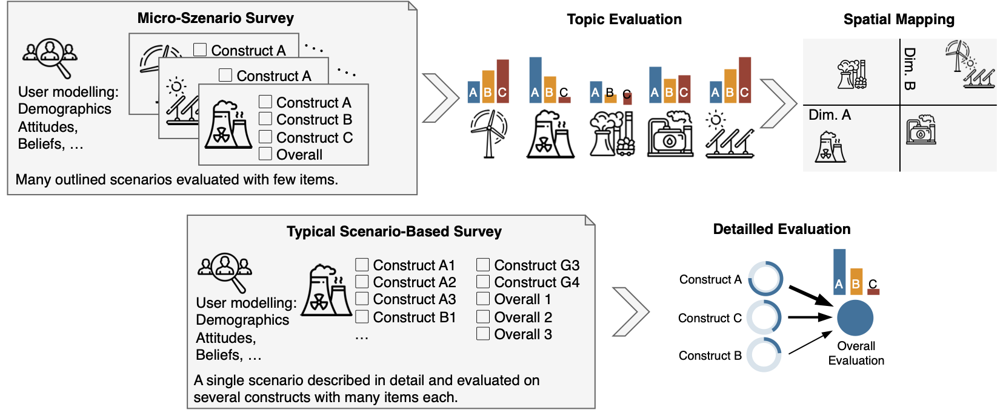
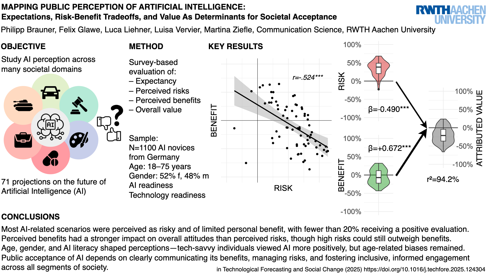

# Introduction

The goal of the micro scenario approach is to gather the evaluation of a wide range of topics on few selected response variables and put the different evaluation into context.
Hereto, the subjects are presented with a large number of different short scenarios and their evaluation of these is measured using a small set of response variables.
The scenario presentation can be a short descriptive text, and/or images, or, in extreme cases, just a single word about an evaluated concept.
We call the former "micro scenarios" and the latter "nano scenarios". The former offers the possibility to briefly explain the evaluated topic whereas the later essentially measures the participants' affective associations towards a single term.

{fig-align="center" #fig-conceptcomparison}


Each scenario is evaluated on a the same small set of response items (see @fig-conceptcomparison).
As many scenarios are evaluated by the participants, we suggest to use no more than three to five items.
With a suitable set of dependent variables, the evaluations offer two different research perspectives:
As the first research perspective, they can be understood, as user variables (individual differences between the participants) and correlations between age, gender, or other user factors can be investigated.
As the second research perspective, the evaluations serve as topic evaluations and relationships between the evaluation dimensions across the different topics can be studied (differences and communalities between the queried topics).
For example, one can explore the relationship between the perceived risk and the perceived utility for a range of different topics or technologies.

We illustrate how studies using the micro scenario approach can be [analysed and visualized](analysis.qmd) and further we created a page that create [synthetic data](synthetic.qmd) for illustrating the analysis. 

Details on this approach, a methodological justification, and practical guidelines can be found in the following article:

> Brauner, Philipp (2024) Mapping acceptance: micro scenarios as a dual-perspective approach for assessing public opinion and individual differences in technology perception. Frontiers in Psychology 15:1419564. doi: [10.3389/fpsyg.2024.1419564](https://www.frontiersin.org/journals/psychology/articles/10.3389/fpsyg.2024.1419564/full)

# Real world application

Here you find a araphical abstract from a refereed article that applied the micro scenario approach in the context of public risk-benefit perceptiopn of Artifical Intelligence.

{fig-align="center" #fig-graphicalabstract}
Link to the article: [https://doi.org/10.1016/j.techfore.2025.124304](https://doi.org/10.1016/j.techfore.2025.124304)

# Slides

If you prefer slides over websites, you can look at the english slidedeck on the appraoch here:
[microscenarios_slides_2025.pdf](microscenarios_slides_2025.pdf)


# List of Studies

Several studies based on this approach have been published or are in the making. We document them here, including the research context, sample size, number of topics queried, and dependent variables. If you use this approach, let us know and we can add your study as well. 


```{r showTableOfStudies, echo=FALSE, warning=FALSE, message=FALSE}
#| column: page

library(tidyverse)
library(rmarkdown)
library(knitr)
library(kableExtra)
library(gt)


STUDIES <- read.csv2("studies.csv") %>%
  dplyr::rename_with( tolower ) %>%
  dplyr::mutate(
    year = as.integer(year),
    published = factor(published,
                       levels = c(FALSE, TRUE),
                       labels = c("(Preprint)", "Yes")))


#  dplyr::mutate(titleLink = paste0(signature, ' (<a href="', str_trim(url, side = "right"), '" target="_blank">Visit</a>)'))

tableContent <- STUDIES %>%
    dplyr::arrange(-published)

tableContent %>%
  dplyr::mutate(
    titleLink = md(paste0("[", signature, "](", url, ")")) # build markdown link
  ) %>%
  gt() %>%
  cols_label(
    titleLink = "Title",
    context = "Context",
    dependents = "Dependents",
    topics = "#Topics",
    samplesize = "#Participants",
  ) %>%
  fmt_markdown(columns = titleLink) %>%   # render markdown
  tab_style(
    style = cell_text(size = pct(80)),
    locations = cells_body(
     rows = published != "Yes"
    )) %>%
  cols_width(
    titleLink ~ px(300),   # first column
    context   ~ px(100)    # second column, half the width
  ) %>%
  cols_align(align = "left", columns = c(titleLink)) %>%
  cols_move_to_start(columns = titleLink) %>%
  cols_hide(c("signature", "url", "published", "year"))
```

Want to add your study? Drop me a message!