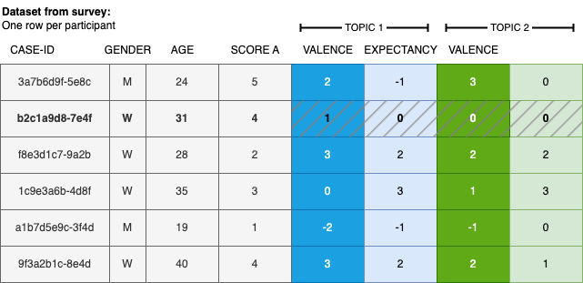

# Introduction

This notebook generates synthetic data to demonstrate the analysis of a micro-scenario-based study.
The corresponding analysis notebook is located in the same folder.
For detailed information on this approach and guidance on designing and analysing studies, please refer to the main article, which you can find and cite here:

> Brauner, Philipp (2024) Mapping acceptance: micro scenarios as a dual-perspective approach for assessing public opinion and individual differences in technology perception. Frontiers in Psychology 15:1419564. doi: [10.3389/fpsyg.2024.1419564](https://www.frontiersin.org/journals/psychology/articles/10.3389/fpsyg.2024.1419564/full)

The general concept behind this simulated dataset is to mimic the data export from typical survey software systems, like Qualtrics.
However, the data is clean, devoid of additional variables, speeders, or erroneous inputs requiring cleaning.
Furthermore, the dataset is structured to exhibit the desired properties of a micro-scenario-based survey, showcasing specific patterns among topics and a defined correlation pattern for evaluation dimensions.

For generating synthetic data, I use the `faux` package; guidance can be found in the [package vignette](https://cran.r-project.org/web/packages/faux/vignettes/rnorm_multi.html).

# Load libraries

In the analysis, I rely on the `tidyverse` and `ggplot` packages.
Additionally, for generating synthetic data with specific properties (e.g., pre-defined means and correlations between variables), I utilize the `faux` package.

```{r LOADLIBRARIES}
library(faux)       # generate correlated multivariate normal data
library(matrixcalc) # check positive-definiteness of matrices
library(tidyverse)
library(scales)     # percent_format() for axis labels
library(ggplot2)    # graphics
library(ggrepel)    # non-overlapping text labels in scatter plots
library(knitr)      # kable() for tables
```

# Create Synthetic Data

In this section, I generate synthetic data that resembles a real Qualtrics survey export.
@fig-surveysdatastructure illustrates the expected data structure: each row represents one participant's responses.

{fig-align="center" #fig-surveysdatastructure}

The dataset contains a unique participant identifier (`id`), a user-level variable (e.g., attitude towards a topic), and *N=12* (adjustable) topic assessments with two columns per topic—one for each evaluation dimension.
Here, *perceived risk* and *perceived utility* are used as the two dimensions; these can be replaced or extended as needed.

The two dimensions are constructed to be inversely correlated across topics (with a non-zero intercept), mimicking a typical risk–utility trade-off pattern.

```{r DATAPOINTS}
N <- 12  # number of topics to simulate
TOPICS <- read.csv2("matrixlabels.csv")  # topic labels for the scatter plot

# Define population means for dimensions A and B on a [-1, +1] scale.
# The sequences are inversely correlated (A increases, B increases more slowly),
# with a shared positive intercept so not all topics are at zero.
evaluationA <- seq(-0.75, 0.50, length.out = N)
evaluationB <- seq(-0.75, 0.10, length.out = N)

# Add small random noise to each mean to make the pattern more realistic
for (i in 1:N) {
  evaluationA[i] <- evaluationA[i] + rnorm(1, mean=0, sd=0.05)
  evaluationB[i] <- evaluationB[i] - rnorm(1, mean=0, sd=0.05)
}

# Manually override one topic to act as an outlier (high B, moderate-low A)
evaluationA[5] <- -1/3
evaluationB[5] <- +1/4

# Concatenate means for both dimensions into a single vector (required by rnorm_multi)
combinedMeans = c(evaluationA, evaluationB)
```

```{r ILLUSTRATION, echo=FALSE}
#| label: fig-targettopicevaluations
#| fig-cap: "Target topic evaluations. Noise due to random sampling will be added in a later step."
# Create a data frame from the vectors
labels = TOPICS$label[1:N]
data <- data.frame(evaluationA, evaluationB, labels)

# Create a scatter plot using ggplot
ggplot(data, aes(x = evaluationA,
                 y = evaluationB,
                 label = labels)) +
  geom_point() +
  geom_text(size = 3, vjust = -1) +  # Labels for points
  labs(x = "Evaluation A",
       y = "Evaluation B",
       title = "Scatter Plot of the Targeted Evaluations A and B",
       subtitle = "This is the basis for the generated survey data which contains additional noise") +
  scale_x_continuous(labels = percent_format(),
                     limits=c( -1, +1 )) +
  scale_y_continuous(labels = percent_format(),
                     limits=c( -1, +1 ))
```

The variables for the topic evaluations must adhere to a standardized naming scheme, i.e., `a01_matrix_02`, where `01` represents the ID of the queried topic, `02` stands for the queried evaluation dimension, and `matrix` denotes the name of the variable block in the survey tool.
This is the naming scheme used by Qualtrics.

```{r DEFINEVARIABLENAMES}
# Build variable names following the Qualtrics Loop & Merge scheme:
# "a{topic}_matrix_{dimension}", e.g. a1_matrix_1, a1_matrix_2, ..., a12_matrix_2
varnames <- c(paste0("a", 1:N, "_matrix_1"), paste0("a", 1:N, "_matrix_2"))
```

The two evaluation dimensions are specified to be positively correlated within each dimension across topics (i.e., topics that score high on risk tend to score similarly across participants), and negatively correlated between dimensions (topics perceived as risky tend to be perceived as less useful).
The sampled data will approximate but not exactly match these population parameters, as expected from random sampling.

```{r DATACORRELATIONS}
# Helper: generate an n×n correlation matrix with off-diagonal values
# drawn uniformly from `range`. The matrix is made symmetric by copying
# the lower triangle to the upper triangle, and the diagonal is set to 1.
generate_cor_matrix <- function(n, range = c(0.2, 0.6)) {
  corr_values <- matrix(runif(n^2, range[1], range[2]), nrow = n)
  for (i in 1:n) {
    for(j in 1:n) {
      corr_values[i,j] = max(-1, min(1, corr_values[i,j])) # clip to [-1, 1]
    }
  }
  for (i in 1:n) {
    for(j in 1:n) {
      corr_values[i,j] = corr_values[j,i] # enforce symmetry
    }
  }
  diag(corr_values) <- 1  # a variable is perfectly correlated with itself
  corr_values
}

# Within-dimension correlation matrices:
# Topics within the same dimension are moderately positively correlated.
cor_matrix_A <- generate_cor_matrix(N)
cor_matrix_B <- generate_cor_matrix(N, range = c(0.3, 0.5))

# Between-dimension correlation matrix:
# Risk and utility are negatively correlated across topics (r = -0.25).
negative_corr <- -.25
cor_matrix_AB <- matrix(negative_corr, nrow = N, ncol = N)

# Assemble the full 2N × 2N block correlation matrix:
#   [ cor_A   cor_AB ]
#   [ cor_AB' cor_B  ]
# This must be symmetric and positive-definite for rnorm_multi to work.
cor_matrix <- matrix(0, nrow = 2 * N, ncol = 2 * N)
cor_matrix[1:N, 1:N] <- cor_matrix_A                          # upper-left:  A–A
cor_matrix[(N+1):(2*N), (N+1):(2*N)] <- cor_matrix_B          # lower-right: B–B
cor_matrix[1:N, (N+1):(2*N)] <- cor_matrix_AB                 # upper-right: A–B
cor_matrix[(N+1):(2*N), 1:N] <- t(cor_matrix_AB)              # lower-left:  B–A (transpose for symmetry)
```

# Check the validity of the data

Before proceeding, we verify that the assembled correlation matrix is symmetric and positive-definite—both required by `rnorm_multi`.
A valid correlation matrix is symmetric by definition, but the block assembly above can occasionally produce a matrix that is not positive-definite due to numerical issues or near-linear dependencies between the blocks.
If the check fails, simply re-run the correlation matrix generation steps; the random elements will differ slightly and the result will usually be valid.

Request to the readers: Any suggestions on how to address this issue more robustly are appreciated. However, this step is not necessary if you already have real survey data, as it specifically pertains to the creation of synthetic data.

```{r CHECKVALIDITY, include=FALSE}
print(paste0("Diagnostics for simulated correlation matrix:"))
print(paste0(" - isSymmetric: ", isSymmetric(cor_matrix)))
print(paste0(" - is positive-definite: ", is.positive.definite(cor_matrix)))
```

Now we draw a random sample from the population defined by the means and correlation matrix above.
Variables are named following the required Qualtrics naming scheme defined earlier.

```{r GENERATEDATAMATRIX}
data <- rnorm_multi(
  varnames = varnames,   # column names following the Qualtrics scheme
  n = 100,               # number of simulated participants
  mu = combinedMeans,    # per-topic population means on [-1, +1] scale
  sd = 0.25,             # within-topic standard deviation
  r = cor_matrix,        # full block correlation matrix
  empirical = FALSE      # sample from population parameters (not fix sample stats exactly)
)
```

# Recode data

Finally, we recode the continuous simulated values to resemble typical Likert-scale survey responses.
First, values are clipped to $[-1, +1]$ (random sampling can occasionally exceed these bounds).
Then they are linearly transformed and rounded to discrete integer values from $1$ to $7$.

```{r BOUNDSANDDISCRETISATION}
data <- as.data.frame(data) %>%
  dplyr::mutate(across(everything(), ~ ifelse(. < -1, -1, ifelse(. > 1, 1, .)))) %>%  # clip to [-1, +1]
  dplyr::mutate(across(everything(), ~ (.+1)/2)) %>%   # shift to [0, 1]:   x' = (x+1)/2
  dplyr::mutate(across(everything(), ~ (6*.))) %>%     # stretch to [0, 6]: x' = 6x
  dplyr::mutate(across(everything(), ~ 1 + round(.)))  # round and shift to {1,...,7}
```

Finally, we add a participant ID and a simulated user-level variable. The user variable is derived from the already-simulated topic scores and is therefore moderately correlated with them.

```{r ADDEXTRAVARIABLES}
data <- data %>%
  dplyr::mutate(id = paste0("fakeparticipantid-", row_number())) %>%  # unique participant ID
  # uservariable is correlated (r = 0.5) with the sum of two topic scores,
  # simulating a user trait related to the evaluated dimensions
  dplyr::mutate(uservariable = rnorm_pre(a1_matrix_1+a2_matrix_1, mu = 10, sd = 2, r = 0.5)) %>%
  dplyr::relocate(id, uservariable)  # move id and uservariable to the front
```

# Save data

Finally, we save the generated data to an RDS file.

```{r SAVEDATA}
saveRDS(data, "syntheticdata.rds")
```

That file is used as input for the [analysis and visualization notebook](analysis.qmd).
